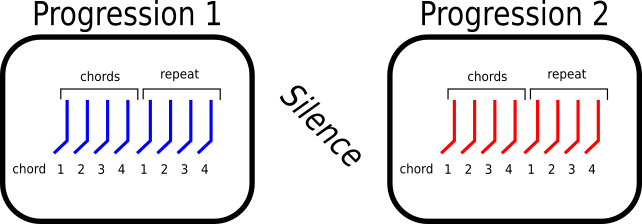

In this experiment you will listen to xxx pairs of chord progressions.
Each "chord progression" is a sequence of four musical chords, at a regular pace.
In each trial, you will hear a *first* chord progression played twice, followed by a short pause, followed by a *second* chord progression played twice:

In some cases, the first and second chord progressions will be very similar, or even exactly the same.
In other cases, they might be very different.
Your goal is to judge how similar *you* think they sound, and tell us using the slider.

If you think the two chord progressions sound exactly the same, set the slider to 0 (far left).
If you think they sound really dramatically different, you could set the slider towards 100 (far right).

Once you've set the slider, click the "submit" button to move on.
After you click "submit," there will be a short pause, then the next pair of progressions will play. 

 Please do not navigate away or refresh the page, as you will have to start over from scratch.

